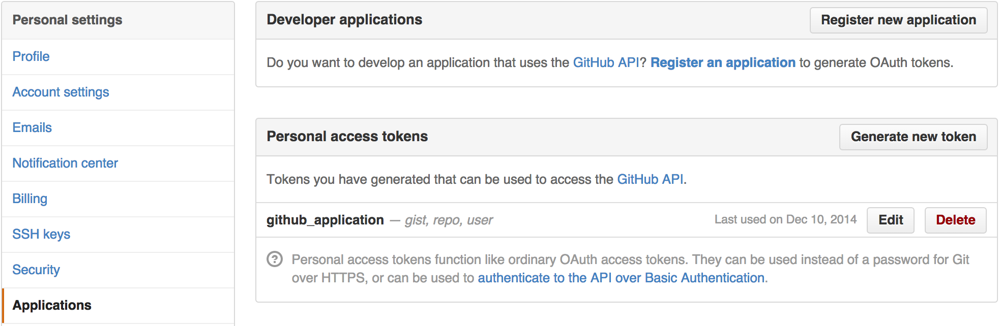

## Interacting with GitHub.com

I interact with GitHub often throughout the day. Many times I am on the
command line and I don't want to open a browser to check GitHub to know
if I have been assigned an issue in a repo. An even more common case is
that I want to create a repo on GitHub.com but I am on the command line.
It is very irritating to have to open a browser and create a repo there
before I push. **My motivation for creating this repo** is that I want
to interact with these certain elements of GitHub.com through the
command line and not utilize the browser. 

#### Getting Started:

These are the different script endpoints that you can utilize (which connect with different [GitHub API](https://developer.github.com/v3/) endpoints) to fetch data (or create data) on GitHub.com. Here are the endpoints with the arguments that must be passed (none are optional):

|Type Of Request|First Parameter|Second Parameter|Third Parameter|Fourth Parameter|
|---|---|---|---|---|
|Assigned Issues|"assigned"|username|label_name|NA|
|My Notifications|"notifications"|username_of_repo_owner|repo_name|NA|
|Comments On Repo Commits|"comments"|username_of_repo_owner|repo_name|NA|
|Create A New Repo|"new_repo"|description_of_repo|created_repo_name|is_private (bool)|

`Note:` All these bash commands start with the `sh execute.sh`
command. I have aliased this to gitline in my shell. It removes the need
to remember the file name.

#### Issues Where You Are Assigned

Example Command Line Request:

```
sh execute.sh assigned username label_name
```

This endpoint will return to you all issues in which you are assigned. It
searches this by label_name which can be one of the GitHub defaults or a
custom one you have created. It also filters based only one ones that
have a status of open and sorts them by their creation date in ascending
order.

#### Fetch Notifications By Repo

Example Command Line Request:
```
sh execute.sh notifications username_of_repo_owner repo_name
```

This endpoint will return you all notifications for a specific repo. The
repo specified must be the username of the repo owner, not your own
username.

#### Comments on Repo Commits

Example Command Line Request:

```
sh execute.sh comments username_of_repo_owner repo_name
```

This will give you comments on commits for a specific repo. Sometimes
someone comments on a commit instead of an issue.

#### Create A New Repo

Example Command Line Request:

```
sh execute.sh new_repo your_username new_repo_name
```

This permits you to create a new repo from the command line. 

#### The Response From Any Of The Three Requests

These script GitHub.com requests will dump out JSON into the terminal. Sample output of a request to an issue endpoint can be seen [at this link](https://developer.github.com/v3/issues/). Sample output of creating a repo can be seen [at this link](https://developer.github.com/v3/repos/#create).

#### Athenticating For Requests That Require Authentication

I use two factor authentication with GitHub and so to create a repo or
to see my notifications I must be authenticated with GitHub. If you do
not have two factor authentication enabled you will be prompted to enter
your password when you issue one of these commands. If that is the case
you can skip this section. If you do have two factor authentication
enabled continue reading along to get the steps to authenticate. 

I create a token in the GitHub interface in `Settings > Applications` (in user settings, not repo settings) and then
click "Generate New Token." Here it is in picture form:



We now need to add this token to a file that is not tracked by source
control. I have a `.privateVariables.sh.sample` file in
the project and my .privateVariables.sh file in the .gitignore file. For
you to get this non-sample file correctly situated just type in this
command:

`cp .privateVariables.sh.sample .privateVariables.sh`

Once you have entered that command then go into the non-sample version
of the file that you just created and enter your token in the quotation marks. You should be
good to go at that point for authenticating. 

#### Create Some Aliases To Move Things Along

For instance, if I wanted to get a detailed view of what issues were
assigned to me with the label of bug I could add this line to my `.bash_profile`:  

`alias=assigned_bugs'sh ~/path/to/file/execute.sh assigned mattcantstop bug`

By typing "assigned_bugs" after you have restarted your terminal or sourced your .bash_profile
you would then received back in your terminal all issues that you are
assigned to with a label of bug.

#### Room For Improvement

Right now I have multi-purposed variables in the script. I have
considered moving some of the requests to a separate file to keep the
argument lists and variables more consistent but find that to be a
premature optimization at this point. I will likely do that as I add
more commands. Feel free to submit a pull request. 

I have also considered making the output more concise and better
formatted by using a JSON parser and pulling out only the details that I
needed but I wanted to keep this simple and not add the complexity of
requiring additional libraries or setup. 
